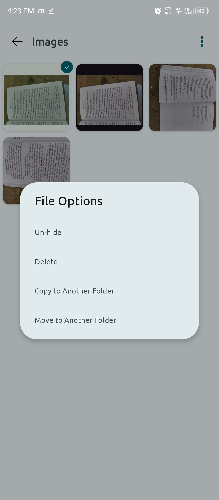

<div align="center">
  


# Calculator Hide File App

<a href="https://github.com/Binondi/Calculator-Hide-Files/releases/latest">
      
</a>

<a href="https://github.com/Binondi/Calculator-Hide-Files/releases/latest">
      
</a>

<a href="LICENSE">
      
</a>

</div>

---
Welcome to the **Calculator Hide File App**! This app is a unique and secure way to hide your sensitive files under the disguise of a fully functional calculator.

---

## Features

- **Dual Functionality**: Operates as a regular calculator and a file hiding app.
- **User-Friendly Interface**: Simple and intuitive design for easy use.
- **Secure File Storage**: Protects your hidden files with a passcode.
- **Passcode Protection**: Access the hidden files by entering a secret passcode in the calculator.
- **File Management**: Easily hide, unhide, and manage files within the app.

---

## Screenshots
<div>
  
  
  
  
  

  </div>
  <div>
  
  
  
  
</div>
---

## How It Works

1. **Calculator Mode**:
   - Perform basic arithmetic operations just like any regular calculator.
2. **Setup Password**:
   - Enter `123456=` to setup your password. 
3. **Hidden Mode**:
   - Enter your secret passcode and hit the `=` button to unlock the hidden file manager.
5. **File Management**:
   - Add files to hide them securely.
   - Retrieve or unhide files as needed.

---

## ☕ Support

Support My development by donating money. Thank you very much for your help! ❤️

[](https://github.com/sponsors/Binondi/Calculator-Hide-Files) [](https://www.paypal.me/BinondiBorthakur56) [](https://buymeacoffee.com/binondi)


---
## Installation

### Prerequisites
- Android Studio (for development)
- A device or emulator running Android 6.0 or higher

### Steps
1. Clone the repository:
   ```bash
   git clone https://github.com/YourUsername/CalculatorHideFileApp.git
   ```
2. Open the project in Android Studio.
3. Build and run the app on your device or emulator.

---

## Technologies Used

- **Programming Language**: Java/Kotlin
- **Development Platform**: Android Studio
- **UI Framework**: Android XML layouts
- **File Storage**: Secure internal storage and MediaStore API

---

## Usage Instructions

1. Open the app.
2. Use the calculator as normal.
3. Enter the secret passcode and press `=` to switch to the hidden file manager.
4. Add or manage your hidden files.

---

## Contributing

We welcome contributions! To contribute:

1. Fork the repository.
2. Create a new branch for your feature or bugfix:
   ```bash
   git checkout -b feature-name
   ```
3. Commit your changes:
   ```bash
   git commit -m "Add a new feature"
   ```
4. Push to the branch:
   ```bash
   git push origin feature-name
   ```
5. Open a Pull Request.

---

## License

This project is licensed under the Apache License 2.0. See the [LICENSE](LICENSE) file for details.

---

## Contact

For any inquiries or feedback, reach out to:
- **Email**: binondiborthakur56@gmail.com
- **GitHub**: [Binondi](https://github.com/Binondi)

---

Thank you for using the **Calculator Hide File App**! We hope you find it secure and easy to use.
