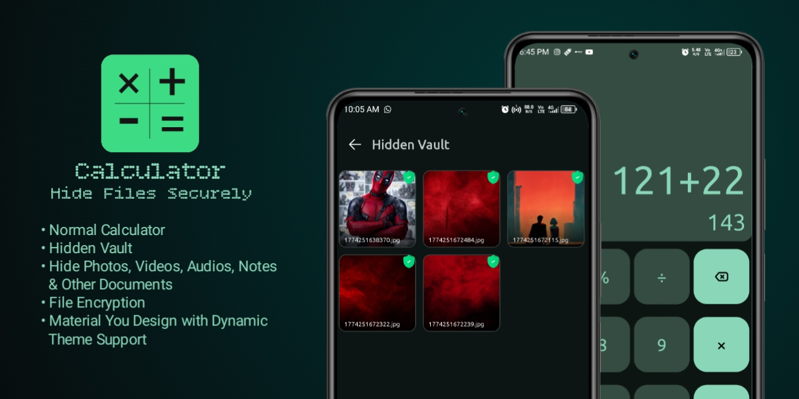
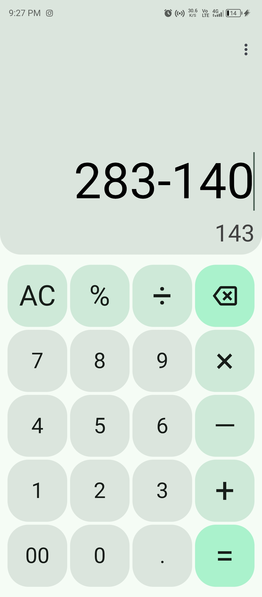
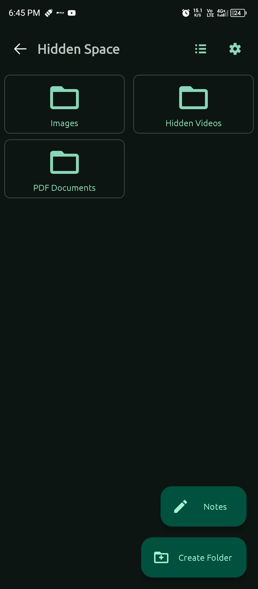
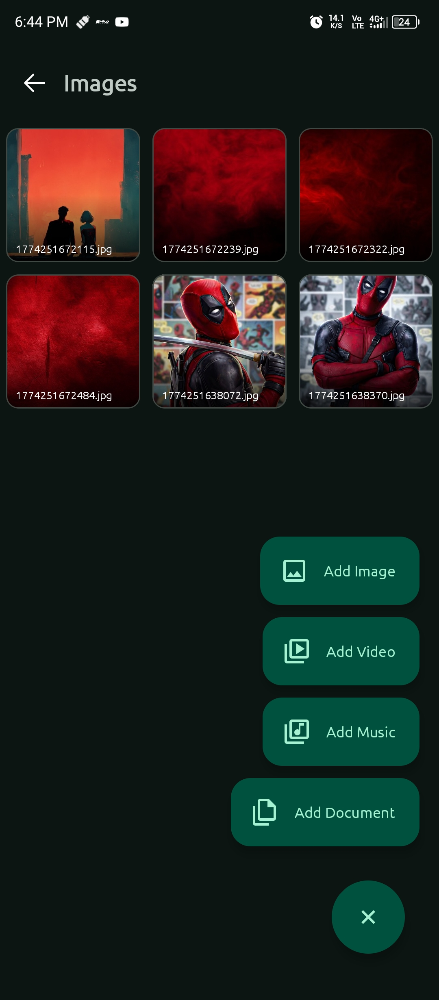
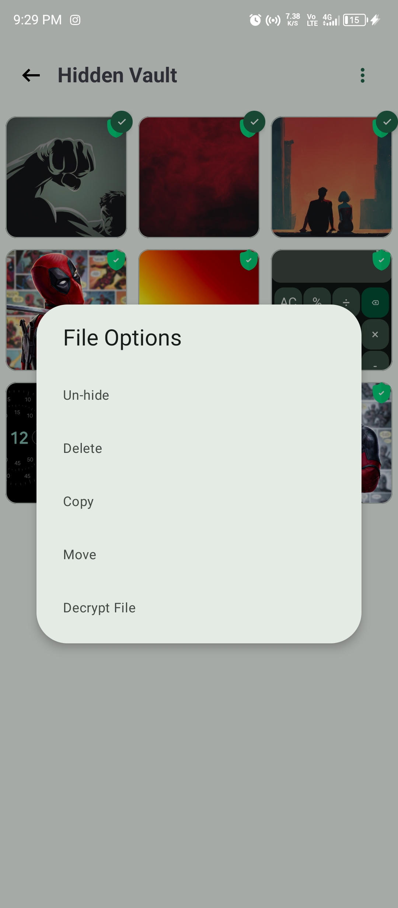
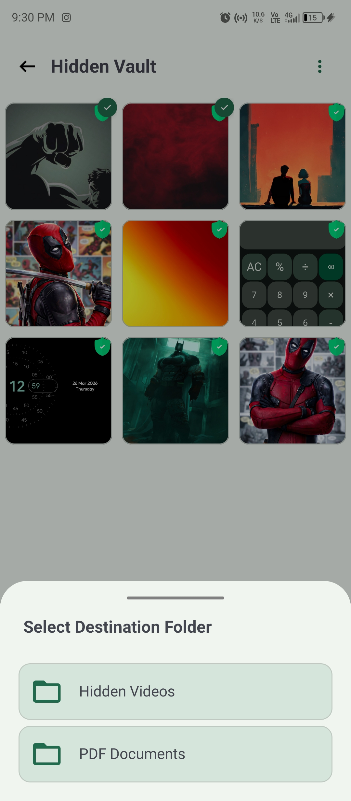
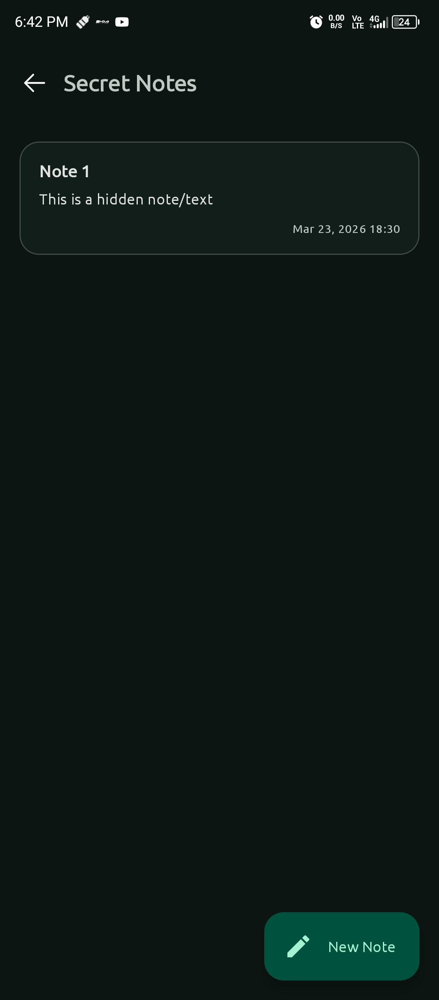
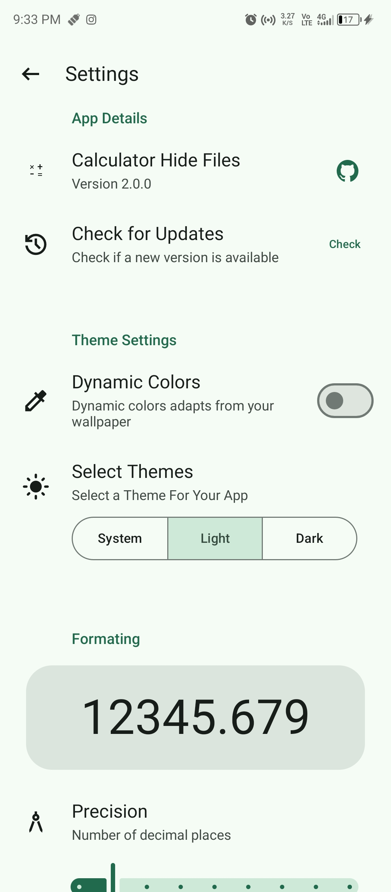

<div align="center">

# 📂 Calculator Hide File App for Android 📂

<a href="https://github.com/Binondi/Calculator-Hide-Files/releases/latest">
      
</a>

<a href="https://github.com/Binondi/Calculator-Hide-Files/releases/latest">
  
</a>

<a href="LICENSE">
  
</a>


<br>
</div>
<div align="center"> 
         
<h4>Download</h4>

<a>[](https://github.com/binondi/Calculator-Hide-Files/releases) </a><a href="https://apt.izzysoft.de/fdroid/index/apk/devs.org.calculator"></a> <a href="https://www.androidfreeware.net/download-apk-devs-org-calculator.html">
[](https://t.me/calculatorhidefilesapp)
</a> 

</div>

## 😍 Why Choose This App?  
The **Calculator Hide File App** is an **open-source** application, allowing you to inspect the code yourself. This ensures **complete transparency** and guarantees that your **privacy remains uncompromised**. 🔒✅  


---

## 🔥 About Calculator Hide File App

The **Calculator Hide File App** is an innovative **Android file-hiding app** that disguises itself as a **fully functional calculator**. It helps you **securely store** private files and protect them with a **hidden passcode**.

> **⭐ Why Choose This App?**  
> - Hide images, videos, documents & other files securely.  
> - Works like a **real calculator** with hidden storage mode.  
> - No one will suspect it’s a file vault!  
> - **Encrypt** files with your **custom key** to secure your hidden files.
---

## 🚀 Features

✅ **Dual Functionality** – A working **calculator** & a **file vault** in one app.  
✅ **Secret Passcode** – Unlock hidden files by entering a secret code.  
✅ **Secure File Manager** – Hide/Unhide files easily.  
✅ **Fast & Lightweight** – Smooth performance on all Android devices.  
✅ **No Root Required** – Works without rooting your phone.  
✅ **Security** – Encrypt & Decrypt files.
---

## 🖼️ Screenshots

<div align="center">
  
  
  
</div>

<div align="center">
  
  
    
</div>

<div align="center">
    
    
    
</div>

---

## 🔑 How It Works

1. **Use as a Regular Calculator**  
   - Perform standard arithmetic operations like a normal calculator.  

2. **Enter Secret Passcode**  
   - Type `123456` and press `=` to set up your password.  
   - Enter your **custom passcode** and hit `=` to unlock the hidden file manager.  

3. **Manage Hidden Files**  
   - Add, remove, and restore hidden files.  
   - Files stay protected even after closing the app.
   - Create Hidden Folders.
   - Move & Copy Hidden Files Between Hidden Folders.

---

## 📥 Download & Installation

### 🔗 **[Download the Latest Version Here](https://github.com/Binondi/Calculator-Hide-Files/releases/latest)**

### 🔹 Prerequisites
- **Android 6.0 or higher**  
- **Storage permissions enabled**
- **Need Manage All Files Permissons For Android 11 and Higher Versions.**

### 🔹 Installation Steps
```bash
git clone https://github.com/Binondi/Calculator-Hide-Files.git
```
- Open **Android Studio** and build the project.  
- Install the APK on your **Android device or emulator**.  

---

## 🛠️ Technologies Used

- **Programming Language**: Kotlin
- **UI Framework**: XML
- **File Storage**: Secure internal storage & MediaStore API  

---

## 🎯 Why Use Calculator Hide File App?

- **No One Can Detect Your Files** – Works like a real calculator.  
- **100% Secure** – Your private files stay hidden, even if someone opens the app.  
- **Completely Free & Open Source** – Modify or contribute to the project.  

---

## ❤️ Support the Project

If you find this app useful, please consider supporting the development. 🙏  

[](https://github.com/sponsors/Binondi)
[](https://paypal.me/BinondiBorthakur56)
[](https://buymeacoffee.com/binondi)

- **UPI ID** 📱
``
binondi@naviaxis
``
---

## 🔧 Contributing

We welcome contributions! To contribute:

1. **Fork the repository**  
2. **Create a new branch**  
   ```bash
   git checkout -b feature-name
   ```
3. **Commit your changes**  
   ```bash
   git commit -m "Add a new feature"
   ```
4. **Push to GitHub**  
   ```bash
   git push origin feature-name
   ```
5. **Create a Pull Request**  

---

## 📜 License

This project is licensed under the **Apache License 2.0**.  
See the full license [here](LICENSE).  

---

## 📧 Contact

For any questions or feedback:  
📩 **Email**: binondiborthakur56@gmail.com  
🐙 **GitHub**: [Binondi](https://github.com/Binondi)  

---

### 🎉 Thank You for Using Calculator Hide File App! 🎉  
🚀 **Keep your files secure and hidden!** 🚀
