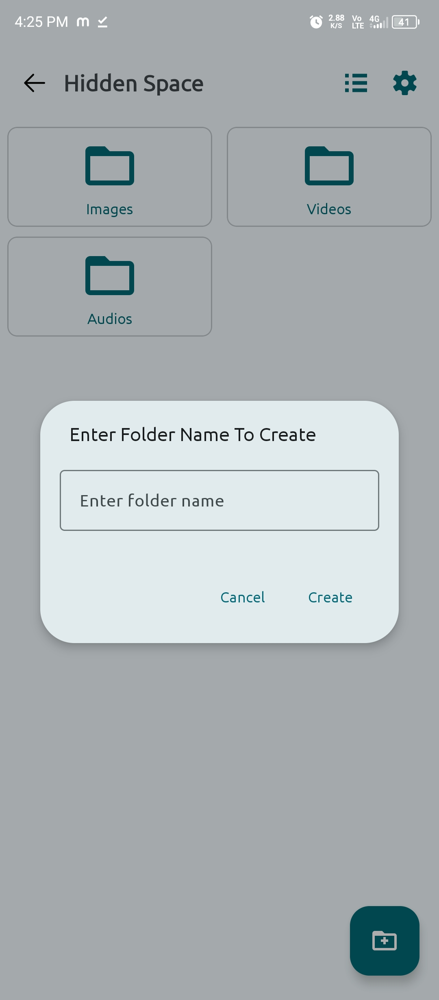
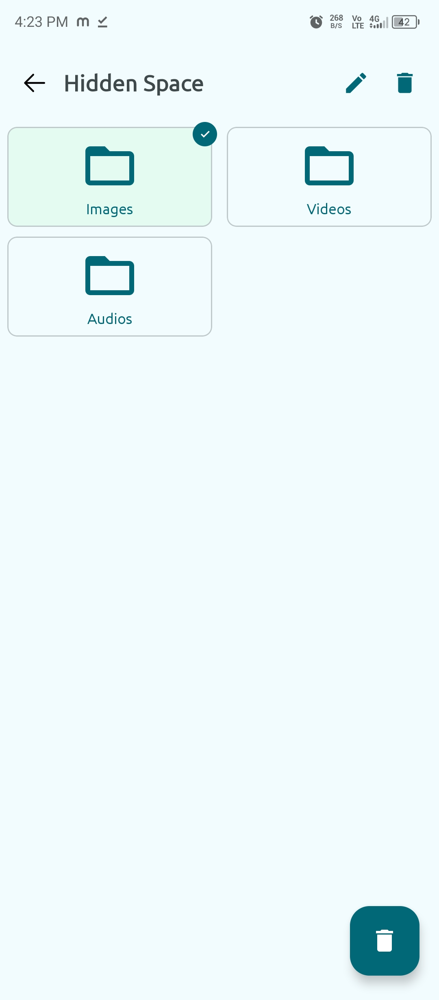

<div align="center">
  

# 📂 Calculator Hide File App for Android 📂

<a href="https://github.com/Binondi/Calculator-Hide-Files/releases/latest">
      
</a>

<a href="https://github.com/Binondi/Calculator-Hide-Files/releases/latest">
      
</a>

<a href="LICENSE">
      
</a>

</div>

---

## 🔥 About Calculator Hide File App

The **Calculator Hide File App** is an innovative **Android file-hiding app** that disguises itself as a **fully functional calculator**. It helps you **securely store** private files and protect them with a **hidden passcode**.

> **⭐ Why Choose This App?**  
> - Hide images, videos, documents & other files securely.  
> - Works like a **real calculator** with hidden storage mode.  
> - No one will suspect it’s a file vault!  

---

## 🚀 Features

✅ **Dual Functionality** – A working **calculator** & a **file vault** in one app.  
✅ **Secret Passcode** – Unlock hidden files by entering a secret code.  
✅ **Secure File Manager** – Hide/unhide files easily.  
✅ **Fast & Lightweight** – Smooth performance on all Android devices.  
✅ **No Root Required** – Works without rooting your phone.  

---

## 🖼️ Screenshots

<div align="center">
  
  
  
  
</div>

---

## 🔑 How It Works

1. **Use as a Regular Calculator**  
   - Perform standard arithmetic operations like a normal calculator.  

2. **Enter Secret Passcode**  
   - Type `123456` and press `=` to set up your password.  
   - Enter your **custom passcode** and hit `=` to unlock the hidden file manager.  

3. **Manage Hidden Files**  
   - Add, remove, and restore hidden files.  
   - Files stay protected even after closing the app.  

---

## 📥 Download & Installation

### 🔗 **[Download the Latest Version Here](https://github.com/Binondi/Calculator-Hide-Files/releases/latest)**

### 🔹 Prerequisites
- **Android 6.0 or higher**  
- **Storage permissions enabled**  

### 🔹 Installation Steps
```bash
git clone https://github.com/Binondi/Calculator-Hide-Files.git
